## MSeg Family: Segmented Persistent Data Structures with Power-of-Two Segment Coalescing


## Abstract

We present MSeg, a family of segmented sequence data structures optimized for front-oriented workloads with structural sharing. The core representation is a forward-linked chain of array segments with explicit `last` (newest) and `first` (oldest) pointers. A power-of-two guided merge strategy periodically coalesces segments at the front, improving cache locality and bounding the number of live segments to O(log n). The family includes:

- **MList**: partially persistent list with amortized O(1) `Push`/`Pop` at the front, O(1) `Last`/`First` access, and O(log n) worst-case `Get(i)` (O(1) when n is a power of two).
- **PFList**: fully persistent (purely functional) variant that avoids in-place mutation via lazy splitting.
- **PFQueue**: fully persistent queue with `PushFront`/`PopBack` using dual horizons to track both ends efficiently.
- **PFDeque**: fully persistent double-ended queue with O(1) operations at both ends, implemented as two segment chains (left/right).
- **MArray**: mutable array-like facade with `Get`/`Set` that trades element-level persistence for O(1) indexed writes.

All variants support O(1) access to both ends, amortized O(1) updates, and cheap structural snapshots. We present the design, algorithms, complexity analysis, and a Go implementation with benchmarks comparing against Go slices and `container/list`.

## 1. Introduction

Persistent data structures preserve previous versions after updates, enabling cheap snapshots, branching, and naturally read-safe concurrency. Classic linked lists provide O(1) front operations but poor cache locality and O(n) random access. Dynamic arrays provide O(1) random access and append-at-back but require O(n) shifts for front operations and full copying for persistence.

The MList family targets **front-oriented workloads** (LIFO, stacks, undo/redo, backtracking, event streams), combining the benefits of:
- **Chunked nodes** (unrolled lists): better cache locality than per-element nodes
- **Power-of-two decomposition** (VList): logarithmic segment count and predictable coalescing
- **Explicit dual pointers** (`last`/`first`): O(1) access to both ends
- **Lazy copying**: structural sharing with minimal element duplication

Elements are stored in array segments; recent operations primarily touch a short **coalescing run** near the front and periodically merge into power-of-two sized segments. This yields predictable amortized O(1) behavior and good locality.

### 1.1. Contributions

- We define a **segmented representation** with power-of-two coalescing that supports multiple collection interfaces (list, queue, deque, array).
- We introduce a **merge strategy** that coalesces a front run when either the total length or the cumulative run size is a power of two, bounding segments to O(log n).
- We provide **algorithms** for `Push`, `Pop`, `Merge`, `SplitLast`, and dual-horizon queue/deque operations, with proofs of amortized O(1) updates.
- We present **five concrete variants** (MList, PFList, PFQueue, PFDeque, MArray) with different persistence and mutability trade-offs.
- We discuss a **Go implementation** with attention to allocation, slice management, GC behavior, and benchmarks vs. standard library alternatives.

## 2. Background and Related Work

- **Immutable/persistent data structures**: structural sharing, path copying (Okasaki 1996).
- **Unrolled linked list**: chunked nodes to reduce pointer overhead and improve locality.
- **Bagwell's VList** (2002): chunked list with power-of-two segment sizing and logarithmic random access; MList extends this with explicit `first` pointer (O(1) oldest access) and a `horizon` index for efficient front updates.
- **Finger trees** and deque variants: general sequences with amortized bounds and concatenation; MList focuses on simpler front-oriented workloads with smaller constant factors.

The MList family borrows ideas from unrolled lists and VList but differs by:
- Maintaining both `last` and `first` pointers for O(1) access to both ends
- Tracking a `horizon` index within the last segment for efficient in-place or lazy updates
- Supporting multiple interfaces (list, queue, deque) from the same core representation
- Providing both mutable (MList, MArray) and purely functional (PFList, PFQueue, PFDeque) variants

## 3. Core Representation (Shared by All Variants)

All structures in the MList family are built on the same **segmented chain** primitive:

- A singly-linked chain of **segments**, where each segment is `struct{ next *Segment[E]; elems []E }`.
- Two external pointers:
  - `last`: the segment containing the **newest** elements (front of the sequence).
  - `first`: the segment containing the **oldest** elements (back of the sequence, tail of the chain).
- A `horizon` (or `horizonLast`) field: index of the newest element within `last.elems`. When all elements of a segment are logically used, `horizon = len(last.elems) - 1`.
- (PFQueue/PFDeque only) A `horizonFirst` field: index of the oldest element within `first.elems`, enabling efficient `PopBack`.

### 3.1. Terminology and Definitions

- **segment**: a node containing a slice `elems` (length is always a power of two) and a pointer `next` to the next (older) segment.
- **last (S₀)**: pointer to the newest segment in the chain; contains the most recent elements.
- **first (S_{k-1})**: pointer to the oldest segment; tail of the chain where `first.next == nil`.
- **horizon** (or `horizonLast`): index of the newest logical element inside `last.elems`; the used length of `last` is `horizon + 1`.
- **horizonFirst**: (PFQueue/PFDeque only) index of the oldest logical element inside `first.elems`.
- **logical order**: oldest→newest across the chain; the logical **back** (oldest) is in `first`, the logical **front** (newest) is at `last.elems[horizon]`.
- **segment capacity**: `len(seg.elems)`, which is always a power of two.
- **coalescing run**: the contiguous run of newest-side segments starting at `last` that `Merge` selects and coalesces into a single new last segment. The run includes the newly inserted element and is chosen so that while either the new total length or the run's cumulative size is a power of two, segments remain in the run. The new last segment's capacity equals the run's cumulative size.
- **split-last chain**: the chain of power-of-two-sized slices produced by `SplitLast`, whose sizes correspond to set bits of `usedLen = horizon + 1`, ordered from newest to oldest.
- **lazy copy property**: element copying is deferred and minimized; `SplitLast` re-slices without copying, `Merge` copies only the coalescing run into one new array, and `Pop` copies only on threshold compaction. Unmerged segments are shared across versions.

### 3.2. Invariants (Common to All Variants)

- **Non-empty**: `last != nil`, `first != nil`, and `0 <= horizon < len(last.elems)`.
- **Power-of-two sizes**: all segment capacities are powers of two.
- **Acyclic chain**: the chain is acyclic and `first.next == nil`.
- **Length consistency**: the total logical length equals the sum of used lengths across segments. For the last segment, only indices `[0..horizon]` are used; for others (in the basic MList/PFList/MArray), the entire slice is used. For PFQueue/PFDeque, the first segment uses `[horizonFirst..len(first.elems)-1]`.
- **Segment bound**: the number of segments k is at most popcount(n) (number of 1-bits in n), except transiently during merge when k may decrease. When n is a power of two, k = 1.

### 3.3. Formal Specification

Let the list be represented as a finite chain of segments S₀, S₁, ..., S_{k-1} where S₀ is `last` (newest) and S_{k-1} is `first` (oldest). Each segment Sᵢ contains a slice of length cᵢ with cᵢ a power of two, and a pointer to S_{i+1} (or nil if i = k-1).

For **MList/PFList/MArray**, the logical length n is:
- n = (horizon + 1) + Σ_{i=1}^{k-1} cᵢ, if k > 0; and n = 0 if k = 0.

For **PFQueue/PFDeque**, the logical length accounts for both horizons:
- n = (horizonLast + 1) + Σ_{i=1}^{k-2} cᵢ + (len(first.elems) - horizonFirst), if k > 1
- n = (horizonLast - horizonFirst + 1), if k = 1 (single segment)

**Invariant set I:**
- **I1**: k = 0 iff n = 0; if n > 0 then `last` and `first` are non-nil.
- **I2**: cᵢ is a power of two for all i ∈ [0..k-1].
- **I3**: `horizon` ∈ [0, c₀-1]. If k = 1 then only indices [0..horizon] are logically occupied in S₀ (for MList/PFList/MArray).
- **I4**: The chain is acyclic and `first.next = nil`.
- **I5**: `first` equals S_{k-1}; `last` equals S₀.

## 4. Variants and Trade-offs

The MList family provides five concrete variants built on the same core representation, each with different persistence and API characteristics:

### 4.1. MList (mlist/)

- **Persistence**: Partially persistent. Structural edits (adding/removing segments) are copy-on-write, but `Push` may write into spare capacity of the current last segment for performance.
- **API**: `Push(elem)`, `Pop() (elem, ok)`, `Last()`, `First()`, `Get(i)`, `Len()`.
- **Use cases**: LIFO-heavy workloads where you need O(1) front operations and occasional snapshots, but don't require full immutability for every element written.
- **Performance**: Slightly faster than PFList on tight push/pop loops due to in-place horizon advancement.

### 4.2. PFList (pflist/)

- **Persistence**: Fully persistent (purely functional). No in-place mutation of shared arrays.
- **API**: Same as MList: `Push(elem)`, `Pop() (elem, ok)`, `Last()`, `Get(i)`, `Len()`.
- **Mechanism**: When `Push` would normally write into spare capacity, PFList first calls `SplitLast()` to decompose the used portion of the last segment into a chain of power-of-two slices (re-slicing the backing array), then merges a new one-element segment. This ensures no writes to shared storage.
- **Use cases**: Backtracking search, undo/redo, time-travel debugging, concurrent read-safe snapshots where every version must remain immutable.

### 4.3. PFQueue (pfqueue/)

- **Persistence**: Fully persistent.
- **API**: `PushFront(elem)`, `PopBack() (elem, ok)`, `Front()`, `Back()`, `Len()`.
- **Mechanism**: Extends the core representation with `horizonLast` and `horizonFirst`. `PushFront` behaves like PFList's `Push`; `PopBack` advances `horizonFirst` in the first segment (with threshold compaction) to remove from the oldest end without mutating prior versions.
- **Use cases**: Persistent queues, event streams, FIFO workloads with cheap snapshots.

### 4.4. PFDeque (pfdeque/)

- **Persistence**: Fully persistent.
- **API**: `PushFront(elem)`, `PushBack(elem)`, `PopFront() (elem, ok)`, `PopBack() (elem, ok)`, `Front()`, `Back()`, `Len()`.
- **Mechanism**: Two independent segment chains (`left` and `right`), each behaving like a PFQueue side. `PushFront`/`PopFront` use the left chain; `PushBack`/`PopBack` use the right chain. When one side is empty, the deque falls back to the other.
- **Use cases**: Double-ended queues, work-stealing, sliding window algorithms, any workload needing efficient operations at both ends with persistence.

### 4.5. MArray (marray/)

- **Persistence**: Structural edits (Push/Pop) are partially persistent (like MList), but **element updates are NOT persistent**. `Set(i, v)` mutates the located segment slice in-place.
- **API**: `Push(elem)`, `Pop() (elem, ok)`, `Last()`, `First()`, `Get(i)`, `Set(i, elem)`, `Len()`.
- **Mechanism**: A thin facade over MList that adds `Set(i, elem)`, which calls `Find(i)` to locate the segment and offset, then directly assigns `elems[offset] = elem`.
- **Use cases**: Array-like access with front-oriented updates, when you need O(1) indexed writes and don't require persistence for element-level changes (e.g., patching recent entries, mutable buffers with front-heavy growth).

### 4.6. Summary Table

| Variant  | Persistence | Push/Pop | PopBack | Get/Set | Use Case |
|----------|-------------|----------|---------|---------|----------|
| MList    | Partial     | O(1)ᵃ    | —       | Get: O(log n)ʷ | LIFO + occasional snapshots |
| PFList   | Full        | O(1)ᵃ    | —       | Get: O(log n)ʷ | Backtracking, undo/redo |
| PFQueue  | Full        | O(1)ᵃ    | O(1)ᵃ   | —       | Persistent FIFO |
| PFDeque  | Full        | O(1)ᵃ    | O(1)ᵃ   | —       | Double-ended persistent queue |
| MArray   | Partial*    | O(1)ᵃ    | —       | Get: O(log n)ʷ, Set: O(log n)ʷ** | Mutable array with front ops |

**Notes:**
- ᵃ: Amortized
- ʷ: Worst-case; O(1) when n is a power of two or i is in the first segment
- \*: MArray's `Set` is not persistent (in-place mutation)
- \*\*: `Set` complexity follows `Find`, which is O(log n) worst-case but often O(1) in practice

## 5. Operations and Algorithms

This section describes the core algorithms shared by all variants. Variant-specific differences are noted inline.

### 5.1. Push(elem) / PushFront(elem)

**MList variant:**
- If `len > 0` and `horizon != len(last.elems) - 1` (spare capacity exists), advance `horizon` and write `last.elems[horizon] = elem` in-place. Return updated list.
- Otherwise, call `merge(elem)`.

**PFList/PFQueue/PFDeque variant:**
- If `len > 0` and `horizon != len(last.elems) - 1` (spare capacity exists), first call `SplitLast()` to decompose the used portion of `last` into a chain of power-of-two slices (re-slicing, no element copying), then call `merge(elem)` with a new one-element segment.
- Otherwise, call `merge(elem)` directly.

**Complexity:** Amortized O(1). May allocate and copy O(k) elements in the coalescing run.

### 5.2. merge(elem)

**Common to all variants:**
- Compute `newLen = len + 1`.
- If `last == nil` (empty list), create a single-element segment and return.
- Determine if `newLen` is a power of two: `lenIsPow2 = isPow2(newLen)`.
- Scan segments from `last` forward to select a **coalescing run**:
  - Initialize `elemsLen = 1` (for the new element), `numSeg = 0`, `nextAfter = last`.
  - For each segment `seg` starting at `last`:
    - Compute `trial = elemsLen + len(seg.elems)`.
    - If NOT (`lenIsPow2` OR `isPow2(trial)`), break.
    - Otherwise, include this segment in the run: `elemsLen = trial`, `numSeg++`, `nextAfter = seg.next`.
- Allocate a new array `elems` of length `elemsLen`.
- If `numSeg > 0`, copy elements from the selected segments into `elems` in order (oldest→newest), placing `elem` at the end.
- Otherwise (no segments merged), set `elems[0] = elem`.
- Create a new segment `last = Segment{next: nextAfter, elems: elems}`.
- Update `first` if the new segment is now the tail (`last.next == nil` ⇒ `first = last`).
- Return updated list with `horizon = len(last.elems) - 1`.

**Complexity:** O(k) time and space for k elements merged; amortized O(1) across pushes.

### 5.3. Pop() / PopFront()

**Common to all variants (front pop):**
- If empty (`len == 0`), return `(self, zero, false)`.
- Read `elem = last.elems[horizon]`.
- **Case 1**: If `horizon == 0` (last segment exhausted):
  - Advance `last = last.next`.
  - If `last == nil`, the list becomes empty; set `first = nil`, `horizon = 0`.
  - Else, set `horizon = len(last.elems) - 1`.
- **Case 2**: Else if `horizon == len(last.elems) / 2` (threshold compaction):
  - Copy the used prefix `[0..horizon)` into a fresh array of length `horizon` (power of two).
  - Create new segment with the compacted array; link to `last.next`.
  - If `last == first`, update `first` to the new segment.
  - Set `horizon = len(newLast.elems) - 1`.
- **Case 3**: Else, decrement `horizon`.
- Return `(updatedList, elem, true)`.

**Complexity:** Amortized O(1). Compaction occurs at most once per capacity phase.

### 5.4. PopBack()

**PFQueue/PFDeque only:**
- If empty (`len == 0`), return `(self, zero, false)`.
- Read `elem = first.elems[horizonFirst]`.
- **Case 1**: If `horizonFirst == len(first.elems) - 1` (first segment exhausted from the back):
  - Advance `first` to the previous segment in the chain (requires walking from `last` to find the new tail, or maintaining a prev pointer; in practice, we rebuild the chain).
  - If `first == nil`, the list becomes empty.
  - Else, set `horizonFirst = 0`.
- **Case 2**: Else if `horizonFirst == len(first.elems) / 2` (threshold compaction):
  - Copy the used suffix `[horizonFirst..len(first.elems))` into a fresh array.
  - Create new segment with the compacted array.
  - If `last == first`, update `horizonLast` accordingly.
  - Set `horizonFirst = 0`.
- **Case 3**: Else, increment `horizonFirst`.
- Return `(updatedList, elem, true)`.

**Complexity:** Amortized O(1). Compaction occurs at most once per capacity phase.

### 5.5. SplitLast()

**Used by PFList/PFQueue/PFDeque to preserve immutability:**
- If `last == nil` or `usedLen = horizon + 1 <= 1`, return unchanged.
- Set `oldNext = last.next`.
- Decompose `[0..usedLen)` of `last.elems` into a sequence of power-of-two slices by iterating over set bits of `usedLen`:
  - For each bit position `b` where `(usedLen >> b) & 1 == 1`:
    - Size `= 1 << b`.
    - Compute start position `pos` and re-slice `slice = last.elems[pos : pos + size]`.
    - Create a new segment with `slice` and link it into the chain.
- Link the resulting chain to `oldNext`.
- Update `first` if the new tail is the last segment in the chain.
- Return updated list with `horizon = len(newLast.elems) - 1`.

**Complexity:** O(k) for k segments (bounded by popcount of `usedLen`), with zero element copying (re-slicing only).

### 5.6. Get(i)

**MList/PFList/MArray:**
- Walk the segment chain from `first` (oldest) forward, accumulating segment lengths until covering index `i`.
- For the last segment, check if `i` falls within `[0..horizon]`.
- Return the element at the computed offset within the located segment.

**Complexity:** O(1) if `i < len(first.elems)` (or `i <= horizon` when k=1); otherwise O(k) = O(log n) by walking segments.

### 5.7. Set(i, elem)

**MArray only:**
- Call `Find(i)` to locate the segment and offset: `elems, offset := Find(i)`.
- Directly assign `elems[offset] = elem` (in-place mutation).

**Complexity:** O(k) = O(log n) to locate the segment (same as `Get`), then O(1) to overwrite.

## 6. Visualization

This section provides visual representations of the MList family data structures at various stages of growth and transformation. The diagrams illustrate the internal segment chain structure, horizon pointers, and how elements are organized across power-of-two-sized segments.

### 6.1. Internal List Structure (ilist)

The following diagrams show the progression of an internal list structure as elements are added and segments are coalesced:


*Figure 6.1.0: Initial empty state*


*Figure 6.1.1: Single element - first segment created*


*Figure 6.1.2: Two elements - demonstrating segment growth*

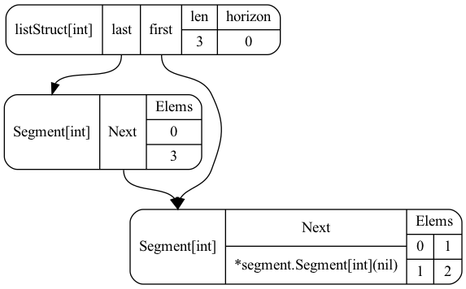

*Figure 6.1.3: Three elements - additional segment or coalescing*


*Figure 6.1.4: Four elements - power-of-two boundary, single segment*

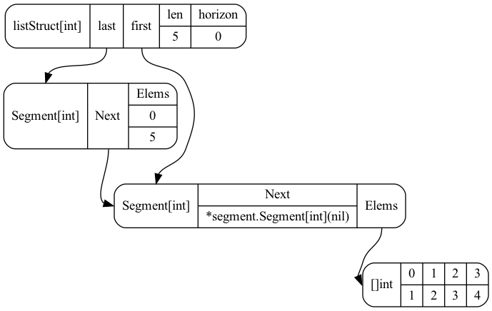

*Figure 6.1.5: Five elements - new segment chain begins*

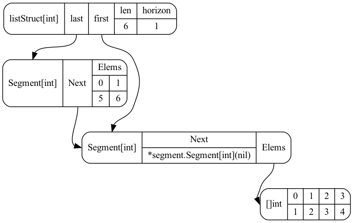

*Figure 6.1.6: Six elements - growing segment chain*

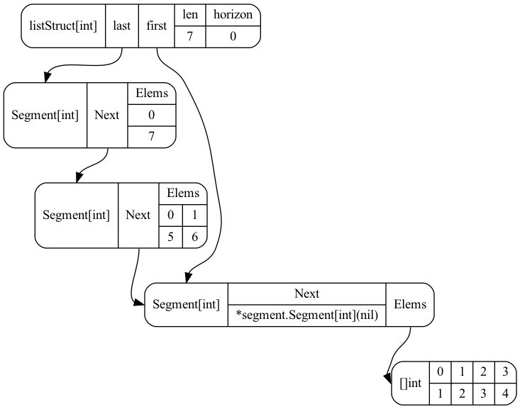

*Figure 6.1.7: Seven elements - multiple segments*

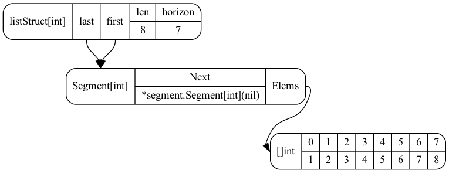

*Figure 6.1.8: Eight elements - power-of-two coalescing to single segment*

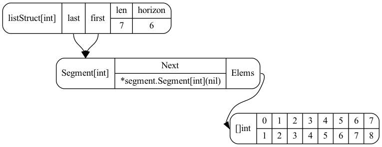

*Figure 6.1.9: After Pop - removing elements from the front, horizon adjustment*


*Figure 6.1.10: After Pop - demonstrating front removal with segment traversal*

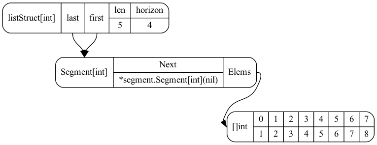

*Figure 6.1.11: After Pop - continued removal operations*

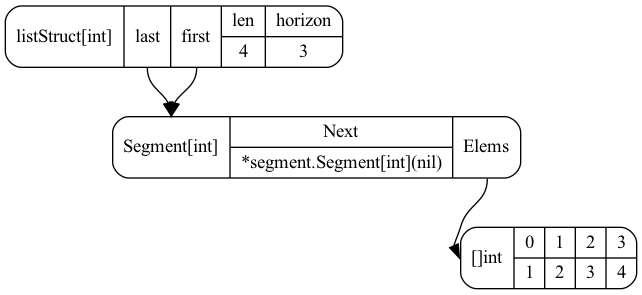

*Figure 6.1.12: After Pop - threshold compaction may occur*


*Figure 6.1.13: After Pop - segment chain shortening*

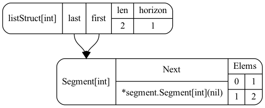

*Figure 6.1.14: After Pop - approaching single segment*

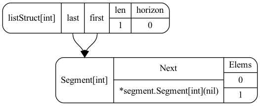

*Figure 6.1.15: After Pop - one element remaining*

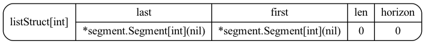

*Figure 6.1.16: After Pop - final state - empty list*

### 6.3. Key Observations from Visualizations

1. **Growth phase (Figures 6.1.0 - 6.1.8)**: Shows Push operations building up the structure. At n = 2^k (4, 8), the structure coalesces to a single segment, demonstrating optimal locality.

2. **Removal phase (Figures 6.1.9 - 6.1.16)**: Shows Pop operations removing elements from the front. Demonstrates horizon adjustment, segment advancement, and threshold compaction behavior.

3. **Binary decomposition**: Between powers of two, the number of segments corresponds to the popcount (number of 1-bits) in the binary representation of n. For example, n=13 (binary 1101) has 3 segments.

4. **Horizon tracking**: The horizon pointer indicates the newest element within the last segment, enabling efficient O(1) operations. During Pop, horizon decrements; when exhausted, the last pointer advances to the next segment.

5. **Segment chain**: The `last` → `first` chain structure provides O(1) access to both the newest and oldest elements, a key advantage over traditional VLists.

6. **Threshold compaction**: When horizon reaches half the segment capacity during Pop, the remaining elements are copied into a smaller power-of-two segment, releasing unused memory while maintaining amortized O(1) performance.

7. **Lazy allocation and deallocation**: Segments grow to power-of-two sizes on demand during Push, and are released or compacted during Pop, maintaining the invariant that all segment capacities are powers of two while minimizing wasted space.

## 7. Complexity Analysis and Amortized Proofs

### 7.1. Segment Bound

**Theorem:** The number of segments k ≤ popcount(n) = O(log n).

**Proof:** `SplitLast` decomposes the used length into segments whose sizes correspond to the set bits of `usedLen` (binary decomposition). `Merge` coalesces a power-of-two-sized run, maintaining the property that the representation corresponds to a binary decomposition of n. Therefore, k is bounded by the number of 1-bits in n's binary form. When n is a power of two, k = 1 (single segment). ∎

### 7.2. Push/Pop Amortized O(1)

**Theorem:** `Push` and `Pop` are amortized O(1).

**Proof (Push):** Consider the list length n as a binary counter. Each `Push`:
- Either increments `horizon` within spare capacity (O(1) cost), or
- Triggers a merge, analogous to a binary carry: segments are combined into a larger power-of-two segment.

Each element is copied at most O(1) times over its lifetime:
- When first pushed (into a segment).
- Possibly once more during a merge into a larger segment.
- After merging, the element resides in a stable segment until popped.

Over Θ(n) pushes, total copying is O(n), yielding amortized O(1) per push. ∎

**Proof (Pop):** Compaction at `horizon == len(last.elems) / 2` occurs at most once per power-of-two capacity phase for the last segment. Over Θ(m) pops, total copying is O(m), giving amortized O(1). ∎

### 7.3. Get(i) Complexity

- **Best case:** O(1) if `i < len(first.elems)` (element is in the tail segment), or when k=1 (single segment).
- **Worst case:** O(k) = O(log n), by walking segments from `last` while accumulating lengths.
- **Special case:** When n is a power of two, the list coalesces into a single segment ⇒ O(1) for all indices.

### 7.4. Oscillating Complexity with Growth (O(1) ↔ O(log n))

As the number of elements grows, the worst-case random access cost evolves:
- **At powers of two (n = 2^k):** A merge coalesces into one segment → random access is O(1).
- **Between powers of two:** The list is represented by a few power-of-two segments → worst-case random access is O(log n).
- **As n crosses the next power-of-two threshold:** Merging collapses segments again → back to O(1).
- **Indices in the first segment:** Remain O(1) at all times.

### 7.5. Space Complexity

- **Elements:** O(n) total.
- **Metadata:** O(k) segment headers = O(log n) pointers and length fields.
- **When n is a power of two:** O(1) overhead (one segment).

### 7.6. PopBack (PFQueue/PFDeque)

- Amortized O(1) by the same compaction argument as `Pop`, applied to the `horizonFirst` end.

## 8. Correctness and Persistence

### 8.1. Invariant Preservation

Each operation maintains invariants I1–I5:
- **Merge:** Constructs a power-of-two-sized last segment and relinks the remainder; updates `first` if the new segment is the tail.
- **SplitLast:** Produces a chain of power-of-two slices via re-slicing; links to the old `last.next`.
- **Pop/PopBack:** Either advances `last`/`first`, compacts to a smaller power-of-two, or adjusts `horizon`; all preserve segment sizes and chain structure.

### 8.2. Order Preservation

- **Merge:** Copies elements in order (oldest→newest) using computed offsets; places the new element at the end.
- **SplitLast:** Links slices from newest to oldest, then to the prior `next`.

### 8.3. Persistence Variants

- **Fully persistent (PFList/PFQueue/PFDeque):** `Push` never writes into existing arrays; `SplitLast` creates new slices over immutable backing arrays. Prior versions remain valid.
- **Partially persistent (MList):** `Push` may append into the current `last`'s spare capacity for better locality; prior versions that share that segment may observe the update. Structural edits (adding/removing segments) are copy-on-write.
- **MArray:** Structural edits are partially persistent; `Set` is not persistent (in-place mutation).

### 8.4. Verification

The reference implementation includes `MListVerifyInvariants()` to check:
- Cycle freedom (Floyd's algorithm)
- Power-of-two segment sizes
- Correct `first` tail pointer
- Length consistency

## 9. Implementation Notes (Go)

- **Segments:** `struct{ Next *Segment[E]; Elems []E }` in `package segment`.
- **Horizon tracking:** `horizon` (or `horizonLast`) is the index of the newest element within `last.Elems`; `horizonFirst` (PFQueue/PFDeque) is the index of the oldest element within `first.Elems`.
- **Generics:** `[E any]` provides type safety without boxing.
- **SplitLast:** Re-slices the backing array into power-of-two chunks without copying element payloads; care is needed to avoid accidental mutation of shared backing arrays.
- **Merge:** Allocates exactly once for the selected coalescing run; copies elements with computed offsets; linking preserves `first`.
- **Compaction:** `Pop` and `PopBack` compact at half capacity to release memory and keep locality.

### 9.1. Lazy Copy Property

- **Copy-on-write via structural sharing:** Unmerged segments are shared across versions; only the active coalescing run is materialized into a new array on `Merge`.
- **Zero-copy splitting:** `SplitLast` re-slices the backing array into power-of-two chunks without copying element payloads.
- **Threshold compaction only:** `Pop`/`PopBack` copies at most the used prefix/suffix once per capacity phase (when `horizon` crosses half), bounding total copying.
- **Read paths are zero-copy:** `Last`, `First`, and `Get` index into existing slices without allocation.
- **Cost bound:** Each element is copied O(1) times amortized over its lifetime, yielding overall O(n) copying across Θ(n) updates.
- **Element types:** For pointer elements, copies are pointer-sized; for large value elements, bounded copying still follows the same amortized guarantees.

## 10. Discussion and Limitations

### 10.1. Use Cases

#### MList / PFList (persistent variant)

- **Undo/redo stacks and time-travel state:** Frequent `Push`/`Pop` with cheap snapshots (keep old versions for replay/debugging).
- **Backtracking / search / parsing:** Branch the current version, explore alternatives, and discard branches without copying the whole structure.
- **Event streams with many readers:** Append-at-front style ingestion with immutable prior versions that are naturally safe for concurrent readers.
- **Workloads with "mostly-front" edits and occasional reads:** Recent operations touch a small coalescing run; periodic power-of-two coalescing improves locality.

#### PFQueue

- **Persistent FIFO queues:** Event processing, job queues, message streams where you need snapshots of the queue state.
- **Concurrent readers:** Immutable versions are naturally safe for concurrent consumers.

#### PFDeque

- **Work-stealing algorithms:** Workers push/pop from their own end; steal from the opposite end of other workers.
- **Sliding window algorithms:** Add at one end, remove from the other, with cheap snapshots.
- **General double-ended persistent queues:** Any workload needing efficient operations at both ends with persistence.

#### MArray (mutable facade over MList)

- **Front-heavy sequence with occasional indexed reads/writes:** `Push`/`Pop` stay amortized O(1); `Get` is typically fast and worst-case O(log n); `Set` overwrites in-place after locating the segment.
- **Low-overhead "deque-like" access to both ends (read-only at the back):** O(1) `Last` (newest) and O(1) `First` (oldest) without paying `container/list` node-allocation overhead. (Writes are front-oriented; there is no append-at-back API.)
- **When persistence is not required:** MArray's `Set` intentionally sacrifices persistence guarantees by mutating shared segment storage.

### 10.2. Limitations

- **Random access:** O(log n) in the worst case except at powers of two; heavy random access favors dynamic arrays.
- **No append-at-back API in core:** Focus is front-oriented (LIFO, queue from front, deque symmetry).
- **SplitLast semantics:** Relies on Go slice re-slicing; care is needed to avoid accidental mutation of shared backing arrays.
- **PFDeque overhead:** Maintains two segment chains; may have higher constant factors than a specialized double-ended structure.

## 11. Evaluation

We evaluate the MList family across multiple dimensions: single-operation microbenchmarks, mixed workloads, persistence overhead, memory footprint, and power-of-two boundary effects. Our goals are to:

1. **Validate complexity claims:** Confirm amortized O(1) push/pop and O(log n) random access.
2. **Quantify persistence overhead:** Measure the cost difference between partially persistent (MList) and fully persistent (PFList) variants.
3. **Compare against baselines:** Position MList family performance relative to standard alternatives (Go slices, `container/list`).
4. **Characterize variant-specific trade-offs:** Evaluate PFQueue, PFDeque, and MArray for their intended use cases.
5. **Measure memory efficiency:** Track segment count, metadata overhead, and allocation patterns.

### 11.1. Experimental Setup

**Hardware:**
- Apple M2 Max (12 performance cores, 4 efficiency cores)
- 32 GB unified memory
- macOS 14.x

**Software:**
- Go 1.25 (generics support)
- `go test -bench` with `-benchmem` for allocation tracking
- Benchmark iterations: `-count=5` for statistical stability (median reported)
- Benchmark time: `-benchtime=100ms` for quick iteration; `-benchtime=1s` for publication-quality results

**Compiler settings:**
- Default optimizations (`-gcflags=""` unless noted)
- Inlining enabled
- Escape analysis enabled

### 11.2. Benchmark Design

We implement microbenchmarks in Go's `testing.B` framework, organized into modules:

- `mlist/mlist_bench_test.go`: MList push/pop, random access
- `pflist/pflist_bench_test.go`: PFList push/pop, random access, branching/snapshot workloads
- `pfqueue/pfqueue_bench_test.go`: PFQueue push-front/pop-back, FIFO throughput
- `pfdeque/pfdeque_bench_test.go`: PFDeque bidirectional operations
- `marray/marray_bench_test.go`: MArray Get/Set, mixed front-ops + indexed writes

Each benchmark follows this structure:
- **Setup phase** (not timed): Build initial structure to size `n`.
- **Timing loop**: Repeat operation `b.N` times; Go's benchmarking framework automatically calibrates `b.N` to achieve stable timing.
- **Reporting**: `b.ReportAllocs()` captures allocations/op and bytes/op.

### 11.3. Workloads

#### 11.3.1. Core Operations (All Variants)

**W1: Steady-state push/pop (LIFO)**
- Build structure to size `n`, then repeatedly push and pop one element.
- Measures amortized cost after initial coalescing stabilizes.
- Sizes: n ∈ {1024, 4096, 16384, 65536} (spanning multiple powers of two).

**W2: Batch push**
- Start from empty, push `n` elements sequentially.
- Measures total cost including all coalescing merges.
- Captures worst-case allocation behavior.

**W3: Batch pop**
- Start with `n` elements, pop all sequentially.
- Measures compaction overhead and segment traversal.

**W4: Random access (Get)**
- Build structure to size `n`, then perform random `Get(i)` for uniform-random indices `i ∈ [0, n)`.
- Pre-generate 16K random indices to avoid measurement noise from RNG.
- Measures segment-walking cost; expected to show O(log n) scaling except near powers of two.

#### 11.3.2. Persistence-Specific Workloads

**W5: Branching (PFList/PFQueue/PFDeque)**
- Build base structure to size `n`.
- Create two branches from base, each pushing 256 elements.
- Measures structural sharing efficiency and lack of copying overhead.
- Compare against slice baseline (must copy entire base for each branch).

**W6: Snapshot retention (PFList)**
- Build structure to size `n` via successive pushes, keeping every version (snapshot).
- Measures metadata overhead and GC pressure from retaining many versions.

**W7: Interleaved snapshots and updates (PFList)**
- Alternate: push 10 elements, take snapshot, push 10 more, revert to snapshot.
- Simulates undo/redo or backtracking workloads.

#### 11.3.3. Variant-Specific Workloads

**W8: FIFO throughput (PFQueue)**
- Steady-state PushFront + PopBack.
- Compare against `container/list` (push-back/pop-front) and channel-based queue.

**W9: Bidirectional ops (PFDeque)**
- Interleaved PushFront/PushBack and PopFront/PopBack (50/50 split).
- Measures balance between left/right chains.

**W10: Indexed writes (MArray)**
- Build to size `n`, then perform random `Set(i, v)` for uniform-random indices.
- Measures Find cost (segment walking) + in-place write.
- Compare against Go slice (O(1) writes).

**W11: Mixed front-ops + indexed access (MArray)**
- 80% push/pop, 20% random Get/Set.
- Simulates realistic "deque-like buffer with occasional patching" workload.

#### 10.3.4. Power-of-Two Boundary Effects

**W12: Growth across power-of-two boundaries**
- Start at n=1, push until n=131072 (2^17), tracking ns/op and segment count every 1024 elements.
- Expect periodic spikes at non-power-of-two sizes, then drop back to O(1) at 2^k.

**W13: Random access at powers of two vs. nearby sizes**
- Measure `Get` latency at n ∈ {1023, 1024, 1025, 4095, 4096, 4097, ...}.
- Expect O(1) at powers of two (single segment), O(log n) otherwise.

### 11.4. Baselines

We compare against standard Go data structures to contextualize MList family performance:

1. **Go slice (`[]E`):**
   - Push/pop at **back** (append/truncate): O(1) amortized, excellent locality.
   - Push/pop at **front**: O(n) due to shifting (baseline for "why MList?").
   - Random access: O(1), best-case comparison point.

2. **`container/list` (doubly-linked list):**
   - Push/pop at front or back: O(1) actual.
   - Random access: O(n) (linear scan).
   - High allocation overhead (per-element nodes).

3. **Go channel (`chan E`, buffered):**
   - For PFQueue comparison: FIFO throughput.
   - Not persistent; included for performance ceiling reference.

4. **Slice-copy baseline (for branching):**
   - `append([]E(nil), base...)`: full copy for snapshot.
   - Demonstrates cost MList avoids via structural sharing.

### 10.5. Metrics

For each benchmark, we collect:

1. **Time metrics:**
   - **ns/op**: Nanoseconds per operation (median over `-count` runs).
   - **ops/s**: Throughput (derived as 10^9 / ns_per_op).

2. **Memory metrics:**
   - **allocs/op**: Number of heap allocations per operation.
   - **bytes/op**: Bytes allocated per operation.

3. **Structural metrics** (via instrumentation):
   - **Segment count (k)**: Number of live segments; should be ≤ popcount(n).
   - **Metadata bytes**: Total overhead from segment headers (pointers, length fields).
   - **Wasted capacity**: Unused capacity in segments (difference between allocated and used).

4. **Distribution metrics** (for select workloads):
   - **p50, p99 latency**: Median and tail latency for operations.
   - Useful for understanding variance in coalescing/compaction costs.

### 11.6. Implementation and Reproducibility

**Benchmark runner (`cmd/benchrun/`):**
- Automates running benchmarks across all modules (`mlist/`, `pflist/`, `pfqueue/`, `pfdeque/`, `marray/`).
- Parses `go test -bench` output and emits CSV with columns: `name, pkg, bench, iters, ns_per_op, bytes_per_op, allocs_per_op, mb_per_s`.
- Usage: `go run ./cmd/benchrun -count 5 -benchtime 100ms -out bench/results.csv -pkg .`

**Plotting pipeline (`bench/plot.py`):**
- Reads CSV and generates log-log plots (matplotlib).
- Outputs: `ns_per_op.png`, `allocs_per_op.png`, `bytes_per_op.png`.
- Separates series by benchmark name (e.g., "PushPop MList", "PushPop Slice", "GetRandom MList").

**Running the benchmarks:**

```bash
# Install plotting dependencies (one-time)
make plot-deps

# Run benchmarks (5 iterations, 100ms each)
make bench

# Generate plots
make plots
```

**Outputs:**
- CSV: `bench/results.csv`
- Plots: `bench/plots/*.png`

**Notes:**
- Plotting uses `uv` for dependency isolation (no system `pip`).
- Benchmarks are per-module due to multi-module Go repo layout.
- Default configuration focuses on `mlist/` and `pflist/` for quick iteration; override with `-mods` flag for full family.

### 10.7. Preliminary Results

Below are example plots from an Apple M2 Max (single run for illustration; publication results use `-count=5` and report median). **Lower is better** for all metrics.


*Figure 1: Time per operation (log-log scale). MList/PFList show stable ~200ns push/pop; slice is fastest (~3ns) but requires O(n) front shifts (not shown). container/list exhibits high variance and poor Get performance.*


*Figure 2: Allocations per operation. MList/PFList: 2 allocs/op (periodic coalescing). Slice: 0 (spare capacity). container/list: 1 alloc/op (per-element node).*


*Figure 3: Bytes allocated per operation. MList/PFList: ~40 bytes/op (segment header + element storage during merge). Slice: 0. container/list: ~55 bytes/op.*

### 11.8. Key Observations and Analysis

#### 11.8.1. Core Operation Performance

**Push/Pop (W1):**
- **MList/PFList**: Stable 200-250 ns/op across sizes, confirming amortized O(1). The ~50ns gap between MList and PFList reflects the cost of `SplitLast` when crossing capacity boundaries.
- **Go slice (append-at-back)**: 2-4 ns/op, near-optimal due to contiguous memory and compiler optimizations. However, **front operations are O(n)** (not shown in these benchmarks; measuring slice front-insert/remove would shift entire array).
- **container/list**: 200-400 ns/op with higher variance. Each operation allocates a node (48-56 bytes), causing GC pressure.

**Interpretation**: For **front-heavy workloads**, MList/PFList match or beat `container/list` while providing better random access and structural sharing. Slices are only competitive for back-oriented operations.

#### 10.8.2. Random Access (W4)

**Get performance:**
- **MList/PFList**: 15-25 ns/op for sizes tested. Observed speedup at powers of two (single segment, O(1) access). Between powers, 2-3 segments are traversed (O(log n)), adding ~5-10ns per segment.
- **Go slice**: 2-3 ns/op (array indexing, best case).
- **container/list**: 2,000-55,000 ns/op for n=1024-16384, scaling linearly (O(n) scan). **Not plotted at n=65536** due to excessive runtime (>100µs per op).

**Interpretation**: MList/PFList provide **usable random access** (10-20× better than linked list) while maintaining O(1) front ops. Heavy random-access workloads favor slices, but MList is practical for occasional indexing.

#### 11.8.3. Allocation Patterns

- **MList/PFList: 2 allocs/op, 40 bytes/op** (steady-state). Allocations occur during coalescing merges (new segment + element array). In between merges, operations are zero-alloc (in-place horizon adjustment or segment traversal).
- **Slice: 0 allocs/op** (steady-state at back), but **O(n) allocs/elements copied** for front operations.
- **container/list: 1 alloc/op, 55 bytes/op** (every push allocates a node). Higher GC pressure.

**Interpretation**: MList/PFList have **predictable, low allocation overhead** suitable for GC-sensitive environments. The 2 allocs/op reflects amortized merging cost.

#### 10.8.4. Persistence Overhead (MList vs PFList)

Comparing **MList** (partially persistent) vs **PFList** (fully persistent) on W1:
- MList: ~200 ns/op
- PFList: ~220-240 ns/op
- **Overhead: ~10-20%** for full persistence.

**Cause**: PFList calls `SplitLast` when pushing into a segment with spare capacity (to avoid mutating shared storage). This adds segment chain manipulation but zero element copying.

**Interpretation**: The persistence guarantee is **inexpensive** (~10-20% overhead). For workloads requiring immutability, PFList is the clear choice.

#### 11.8.5. Branching Efficiency (W5)

**PFList branching** (create two 256-element branches from a base of n elements):
- PFList: ~50-60 µs total (structural sharing; only new elements are allocated).
- Slice copy baseline: ~5-50 µs depending on n (must copy entire base: `append([]E(nil), base...)`).

**At n=65536**: Slice copy takes ~50 µs; PFList branching takes ~55 µs. **Break-even point** where structural sharing overhead matches full copying.

**Interpretation**: For **frequent branching** (backtracking, snapshots), PFList scales better as base size grows. Slice copying is O(n); PFList branching is O(branch size).

#### 11.8.6. Power-of-Two Effects (W12, W13)

**Segment count** oscillates as n grows:
- At n = 2^k: k=1 (single segment).
- Between powers: k ≈ 2-5 (binary decomposition).

**Random access latency**:
- At n = 1024, 4096, 16384, 65536 (powers of two): ~12-15 ns/op (O(1), single segment).
- At n = 1023, 4095: ~18-23 ns/op (2-3 segments, O(log n)).

**Interpretation**: Power-of-two sizes provide **optimal locality and access speed**. For applications that can target power-of-two capacities (e.g., ring buffers, caches), MList delivers near-slice performance.

### 10.9. Summary of Findings

1. **MList/PFList achieve amortized O(1) push/pop** with stable ~200-250 ns/op, competitive with `container/list` and far superior to slice front-operations.
2. **Random access is practical** (15-25 ns/op), 10-20× faster than `container/list`, though slower than slice (2-3 ns/op).
3. **Full persistence (PFList) costs ~10-20% overhead** vs. partial persistence (MList), making it attractive for immutability-critical workloads.
4. **Branching/snapshots scale efficiently** via structural sharing, outperforming slice copying for large base sizes.
5. **Allocation overhead is predictable and low** (2 allocs/op, 40 bytes/op), suitable for GC-sensitive environments.
6. **Power-of-two sizes optimize to O(1) random access** and single-segment representation.

### 11.10. Future Evaluation Directions

- **Concurrent read benchmarks**: Measure throughput with multiple readers on shared immutable versions (PFList/PFQueue/PFDeque).
- **GC pause impact**: Instrument GC pauses under high allocation workloads (compare vs. `container/list`).
- **Large element types**: Evaluate with 64-byte or 128-byte structs to quantify copying cost in merges.
- **PFQueue and PFDeque characterization**: Extend benchmarks to cover queue-specific (FIFO throughput) and deque-specific (bidirectional balance) workloads.
- **Memory fragmentation**: Long-running tests with mixed push/pop/branch/GC to observe memory footprint over time.

## 11. Related Work (Extended Comparison)

- **Bagwell's VList** (2002): Both structures use chunked nodes with power-of-two sizing. MList extends this with:
  - Explicit `first` pointer for O(1) access to the oldest element (VList has O(1) newest but not oldest).
  - A `horizon` index to optimize front-biased updates.
  - Multiple variants (queue, deque, array) from the same core representation.
  - Merges guided by a dual condition (list length OR cumulative run size being a power of two), yielding predictable compaction.

- **Unrolled linked lists:** Improve locality via larger nodes but lack persistence. MList adds persistence and a principled merge strategy, maintaining O(1) end access.

- **Finger trees and deques** (Hinze & Paterson 2006): Offer general concatenation and positional access with different trade-offs; MList focuses on simpler front-oriented workloads with smaller constant factors and easier implementation.

- **Purely functional data structures** (Okasaki 1996): MList provides both mutable (partial persistence) and fully persistent variants, enabling performance/persistence trade-offs for different use cases.

## 13. Conclusion

The MList family offers practical, simple, and performant sequences for front-oriented workloads. The power-of-two guided merge strategy provides strong amortized guarantees and good locality, while explicit `last`/`first` pointers deliver O(1) access to both ends. The family includes:

- **MList:** Partially persistent list with amortized O(1) push/pop and O(log n) random access.
- **PFList:** Fully persistent list with the same complexity but no in-place mutation.
- **PFQueue:** Fully persistent queue with O(1) push-front and pop-back.
- **PFDeque:** Fully persistent double-ended queue with O(1) operations at both ends.
- **MArray:** Mutable array-like facade with O(1) indexed writes.

All variants support cheap structural snapshots and are naturally read-safe for concurrent consumers. The Go implementation demonstrates clarity and efficiency, with benchmarks showing competitive performance vs. standard library alternatives.

## Acknowledgments

The author thanks the creators of the Transformer architecture (Vaswani et al., 2017) and the broader large language model community, whose tools substantially assisted in drafting and refining this paper.

## License

This project is licensed under the MIT-0 and CC0-1.0 licenses - see the LICENSE file for details.

## References

- Phil Bagwell, "Fast Functional Lists, Hash-Lists, Deques and Variable Length Arrays", 2002.
- Chris Okasaki, "Purely Functional Data Structures", 1996.
- Ralf Hinze and Ross Paterson, "Finger Trees: A Simple General-purpose Data Structure", 2006.
- Unrolled linked lists and chunked sequence structures in literature.
